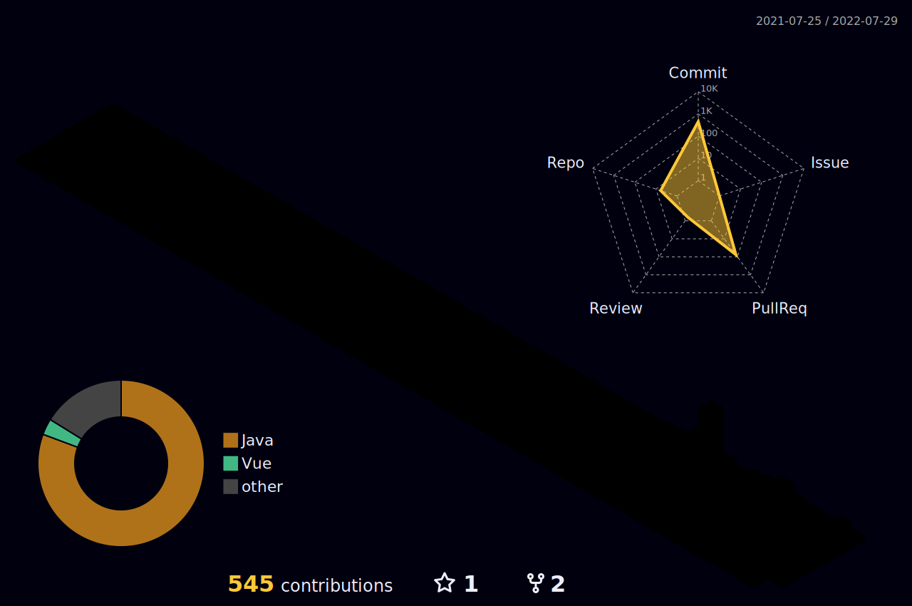

### 📚 My blog

 ### :trophy: Project

      

 
 # 🔱TECH STACK🔱
### techs that i've used at least once
 
 

 
 
 
   
 

   
 
 
 

 <!----------------아이콘 원본

 
 
  
 
 
  
 
 
 
   
  
  
 
 
   
 

   
 
 
 
 

 -->
  
 

<!--  -->
<!--  -->

<!-- ### ✨ Profile
 -->

 

